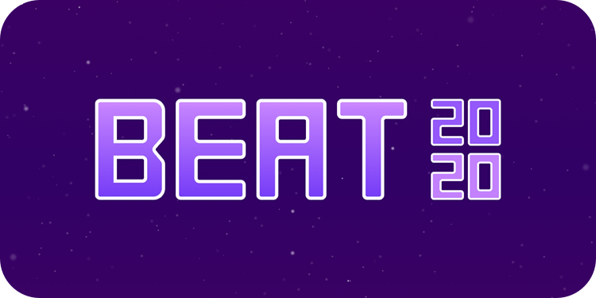

 

## Introduction 👋
This playground book is a submission for the [WWDC20 Swift Student Challenge](https://developer.apple.com/wwdc20/swift-student-challenge/) and consists of a game called Beat, where the player creates music by jumping over obstacles.

## More
- There is a [playthrough video on Youtube](https://youtu.be/ayVB08sXtZY).

## Credits
- "Do I Wanna Know?" by Arctic Monkeys
- "We Will Rock You" by Queen
- "Superstição" and "Velho Hábito" by Lista de Ausência
